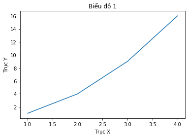
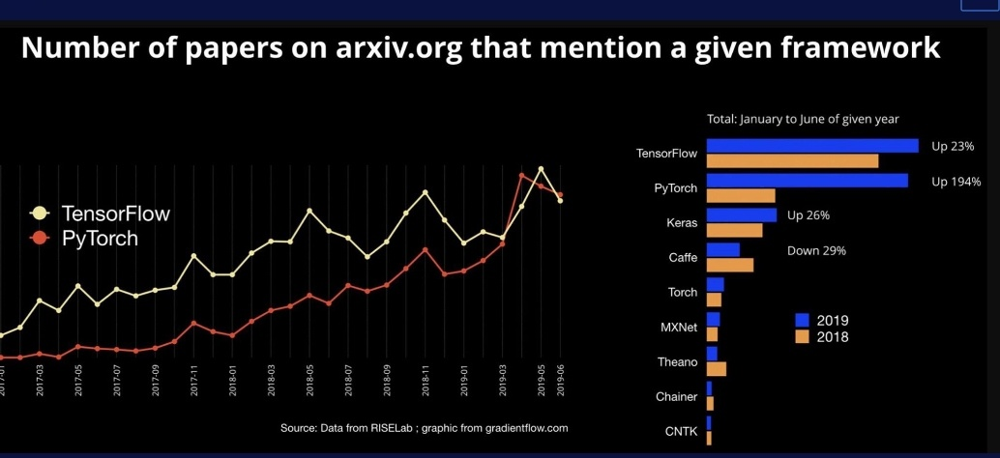
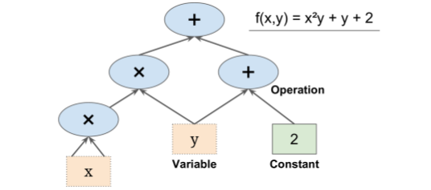

# <center>Top 10 Thư Viện Python Phổ Biến Cho Machine Learning</center>

## Giới Thiệu
Hiện nay, khi Machine Learning đã và đang trở thành xu hướng thì việc học và tiếp cận trở nên rất phổ biến. Nắm bắt được xu hướng đó thì dưới đây là tổng hợp lại top 10 thư viện phổ biến nhất dành cho Machine Learning. Các thư viện này dựa trên khảo sát qua nhiều trang web tổng hợp về Top 10 thư viện phổ biến nhất trong Machine Learning. 

Trước hết, ta cần biết Machine Learning là gì ?
+ Machine learning ("học máy" hay "máy học") là một nhánh của AI (trí tuệ nhân tạo), chuyên xây dựng các thuật toán để máy tính __tự học__ các qui luật và tri thức từ các tập __dữ liệu__ được cung cấp. Nó khác với cách tiếp cận cổ điển của AI, gọi là symbolic AI, ở đó các tri thức và quy luật được người dùng lập trình cứng (hard code) cho máy tính thực hiện.

Sau đây là top 10 thư viện được mình chọn lọc mời các bạn tham khảo.

## Danh Sách Nội Dung:
1. [**NumPy**](#1.-NumPy:)
2. [**Pandas**](#2.-Pandas:)
3. [**Matplotlib**](#3.Matplotlib:)
4. [**Scikit-learn**](#4.-Scikit-learn:)
5. [**PyTorch**](#5.-PyTorch:)
6. [**Tensorflow**](#6.-Tensorflow:)
7. [**Keras**](#7.-Keras:)
8. [**OpenCv**](#8.-OpenCV:)
9. [**SciPy**](#9.-SciPy:)
10. [**Natural Language Toolkit**](#10.-Natural-Language-Toolkit:)

## 1. NumPy:

NumPy là một thư viện mã nguồn mở của Python, rất phổ biến, cần thiết khi bắt đầu tiếp cận Machine Learning. Nó được phát triển bởi [Travis Oliphant](https://en.wikipedia.org/wiki/Travis_Oliphant) vào năm 2006 dựa trên nền tảng trước đó là Numeric và Numarray. Hơn nữa, NumPy cung cấp nhiều chức năng tính toán phù hợp với các cấu trúc dữ liệu mạnh mẽ ở dạng mảng và ma trận đa chiều một cách hiệu quả với số lượng dữ liệu khổng lồ và xử lý các phép toán phức tạp.

**Các điểm nổi bật của NumPy:**
+ Triển khai nhanh chóng, hiệu quả đối với các mảng đa chiều.
+ Khả năng thực hiện tốt, tối ưu các phép toán trên ma trận.
+ Được cộng đồng khoa học tin dùng.
+ Tốc độ tính toán nhanh, tiêu tốn ít bộ nhớ hơn nhiều so với kiểu danh sách (list) mặc định của Python.
+ NumPy thường được sử dụng cùng SciPy và Matplotlib để thay thế cho MatLab vô cùng đắt đỏ.

**Tài liệu học NumPy:** [Tại Đây](https://numpy.org/doc/)

### Ví Dụ: Thực hiện các phép tính toán cơ bản trên vector và ma trận với NumPy


```python
#Import thư viên numpy vào để sử dụng
import numpy as np

#Tạo mảng 1 chiều (vector)
arr_1 = np.array([1, 2, 3])
arr_2 = np.array([6, 3, 2])
#Thực hiện phép toán cộng 1 mảng (vector)
print('Phép Toán cộng 2 Vector:')
print(arr_1 + arr_2)

#Tạo mảng 2 chiều (matrix)
matrix_1 = np.array([[4, 2],
                     [5, 1]])
matrix_2 = np.array([[9, 10],
                     [3, 4]])
#Thực hiện phép toán nhân 2 ma trận
print('Phép Toán nhân 2 Ma trận:')
print(np.dot(matrix_1, matrix_2))

#Phát sinh ngẫu nhiên mảng 1 chiều (vector) với các phần tử kiểu int
rand_arr = np.random.randint(1, 10, size = 10)
print('Random mảng 1 chiều: ')
print(rand_arr)
```

    Phép Toán cộng 2 Vector:
    [7 5 5]
    Phép Toán nhân 2 Ma trận:
    [[42 48]
     [48 54]]
    Random mảng 1 chiều: 
    [3 7 3 5 8 3 1 3 1 4]
    

## 2. Pandas:
Pandas là một thưu viện mã nguồn mở, hỗ trợ đắc lực trong việc thao tác, xử lý trên dữ liệu trong Python, được viết bởi [Wes McKinney](https://en.wikipedia.org/wiki/Wes_McKinney) trong năm 2008, xây dựng dựa trên nền tảng của NumPy. Pandas ở đây không liên quan đến các chú gấu trúc như tên của nó, mà là một từ được viết tắt có nguồn gốc từ **'Python and Data Analysis'** và **'Panel Data'**. Đây cũng là bộ công cụ phân tích và xử lý dữ liệu mạnh mẽ, cung cấp cấu trúc dữ liệu đặc biệt là DataFrame, tương tác tốt trên dữ liệu dạng bảng và chuỗi thời gian, được sử dụng rộng rãi trong nguyên cứu và các ứng dụng về khoa học dữ liệu.

**Đặc Điểm Nổi Bật:**
+ DataFrame đem lại sự linh hoạt và rất hiệu quả trong việc thực hiện các thao tác trên dữ liệu dạng bảng.
+ Là bộ công cụ cho phép đọc nhiều dạng file khác nhau như: excel, csv, json,...
+ Liên kết được các dữ liệu, xử lý các trường hợp dữ liệu bị thiếu. Đưa dữ liệu lộn xộn về dạng có cấu trúc và cũng dễ dàng thay đổi được cấu trúc của dữ liệu.
+ Cho phép tách, đánh chỉ mục và chia nhỏ được tập dữ liệu dựa trên các nhãn.
+ Được dùng trong nhiều lĩnh vực như: học thuật, thương mại, tài chính, kinh tế,...

**Tài Liệu Học Pandas:** [Tại Đây](https://pandas.pydata.org/docs/)

Dữ liệu về covid-19 được dùng trong đoạn code bên dưới được lấy từ: [COVID-19 Complete Dataset (Updated every 24hrs)](https://www.kaggle.com/imdevskp/corona-virus-report)

### Ví Dụ: đọc file csv có dữ liệu về covid-19


```python
#Import thư viện Pandas 
import pandas as pd

#Đọc File dữ liệu về Covid-19 đã có sẵn, truyền path chứa dữ liệu
#pd.read_csv('path file')
df = pd.read_csv('covid_19_clean_complete.csv')

#Hiện các dữ liệu về covid-19 vào ngày 3/4/2020 dưới định dạng m/d/y
df[df['Date'] == '4/3/20']
```


<div>
<table border="1" class="dataframe">
  <thead>
    <tr style="text-align: right;">
      <th></th>
      <th>Province/State</th>
      <th>Country/Region</th>
      <th>Lat</th>
      <th>Long</th>
      <th>Date</th>
      <th>Confirmed</th>
      <th>Deaths</th>
      <th>Recovered</th>
    </tr>
  </thead>
  <tbody>
    <tr>
      <th>18432</th>
      <td>NaN</td>
      <td>Afghanistan</td>
      <td>33.000000</td>
      <td>65.000000</td>
      <td>4/3/20</td>
      <td>281</td>
      <td>6</td>
      <td>10</td>
    </tr>
    <tr>
      <th>18433</th>
      <td>NaN</td>
      <td>Albania</td>
      <td>41.153300</td>
      <td>20.168300</td>
      <td>4/3/20</td>
      <td>304</td>
      <td>17</td>
      <td>89</td>
    </tr>
    <tr>
      <th>18434</th>
      <td>NaN</td>
      <td>Algeria</td>
      <td>28.033900</td>
      <td>1.659600</td>
      <td>4/3/20</td>
      <td>1171</td>
      <td>105</td>
      <td>62</td>
    </tr>
    <tr>
      <th>18435</th>
      <td>NaN</td>
      <td>Andorra</td>
      <td>42.506300</td>
      <td>1.521800</td>
      <td>4/3/20</td>
      <td>439</td>
      <td>16</td>
      <td>16</td>
    </tr>
    <tr>
      <th>18436</th>
      <td>NaN</td>
      <td>Angola</td>
      <td>-11.202700</td>
      <td>17.873900</td>
      <td>4/3/20</td>
      <td>8</td>
      <td>2</td>
      <td>1</td>
    </tr>
    <tr>
      <th>...</th>
      <td>...</td>
      <td>...</td>
      <td>...</td>
      <td>...</td>
      <td>...</td>
      <td>...</td>
      <td>...</td>
      <td>...</td>
    </tr>
    <tr>
      <th>18683</th>
      <td>NaN</td>
      <td>MS Zaandam</td>
      <td>0.000000</td>
      <td>0.000000</td>
      <td>4/3/20</td>
      <td>9</td>
      <td>2</td>
      <td>0</td>
    </tr>
    <tr>
      <th>18684</th>
      <td>NaN</td>
      <td>Botswana</td>
      <td>-22.328500</td>
      <td>24.684900</td>
      <td>4/3/20</td>
      <td>4</td>
      <td>1</td>
      <td>0</td>
    </tr>
    <tr>
      <th>18685</th>
      <td>NaN</td>
      <td>Burundi</td>
      <td>-3.373100</td>
      <td>29.918900</td>
      <td>4/3/20</td>
      <td>3</td>
      <td>0</td>
      <td>0</td>
    </tr>
    <tr>
      <th>18686</th>
      <td>NaN</td>
      <td>Sierra Leone</td>
      <td>8.460555</td>
      <td>-11.779889</td>
      <td>4/3/20</td>
      <td>2</td>
      <td>0</td>
      <td>0</td>
    </tr>
    <tr>
      <th>18687</th>
      <td>NaN</td>
      <td>Malawi</td>
      <td>-13.254308</td>
      <td>34.301525</td>
      <td>4/3/20</td>
      <td>3</td>
      <td>0</td>
      <td>0</td>
    </tr>
  </tbody>
</table>
<p>256 rows × 8 columns</p>
</div>


## 3. Matplotlib:
Để thực hiện việc thống kê và trực quan hóa dữ liệu của bạn thì Matplotlib là một giải pháp tối ưu cho việc đó. Nó là một thư viện vẽ đồ thị rất mạnh mẽ và hữu ích đối với những người sử dụng Python và NumPy. Nó được phát triển bởi [John D. Hunter](https://en.wikipedia.org/wiki/John_D._Hunter) vào năm 2003. Với Matplotlib bạn có thể tạo ra các biểu đồ như: Histograms, Cột, Tròn, Scatter,... với chỉ một vài dòng mã.

**Các đặc trưng nổi bật:**
+ Là một thư viện dễ tiếp cận, dễ sử dụng cho người mới bắt đầu.
+ Có giao diện gần gũi, cú pháp đơn giản dễ hiểu.
+ Cung cấp các tính năng để kiểm soát các kiểu đường kẻ, phông chữ, định dạng,...giúp các lập trình viên dễ dàng quản lí hơn.

**Tài liệu học** [Tại Đây](https://matplotlib.org/3.1.1/contents.html)


```python
# import thư viện matplotlib
import matplotlib.pyplot as plt 
# Khởi tạo giá trị biểu đồ dạng đường
plt.plot([1,2,3,4],[1,4,9,16])
# Đặt tiêu đề cho biều đồ
plt.title('Biểu đồ 1')
# Đặt tiêu đề cho trục hoành & trục tung
plt.xlabel('Trục X')
plt.ylabel('Trục Y')
# Hiển thị
plt.show()
```





## 4. Scikit-learn:
Scikit-learn là một thư viện mã nguồn mở, rất mạnh mẽ, thông dung, được viết phần lớn bởi Python dành cho Machine Learning, được phát triển bởi [David Cournapeau](https://en.wikipedia.org/wiki/David_Cournapeau) trong một dự án có tên [Google Summer of Code](https://en.wikipedia.org/wiki/Google_Summer_of_Code) vào năm 2007. Scikit-learn được thiết kế dựa trên nền tảng của Numpy và SciPy, chứa hầu hết các thuật toán hiện đại nhất được xây dựng sẵn như: classification, regression, clustering,... Đây cũng là một trong top các thư viện nổi tiếng của Machine Learning được dùng nhiều trong các dự án trên Github.

**Đặc điểm nổi bật:**
+ Hỗ trợ hầu hết các thuật toán cơ bản của Machine Learning, dễ dàng sử dụng, mang lại hiệu quả cao.
+ Được công đồng nguyên cứu Machine Learning tin dùng.
+ Bộ dữ liệu có sẵn phong phú, phù hợp cho việc tìm hiểu, học tập.
+ Cung cấp bộ công cụng tiền xử lý để làm sạch dữ liệu.

**Tài liệu học Scikit-Learn:** [Tại Đây](https://scikit-learn.org/stable/tutorial/index.html)

### Ví Dụ: Lấy dữ liệu từ thư viện datasets trong scikit-learn


```python
#import thư viện sklearn
from sklearn.datasets import load_iris
import pandas as pd
#lấy dữ liệu của hoa iris
iris = load_iris()

#Đưa dữ liệu vào DataFrame của Pandas
X = pd.DataFrame(iris.data, columns=iris.feature_names)
y = pd.DataFrame(iris.target,columns = ['types'])

#Kết nối dữ liệu và nhãn
label = pd.concat([X,y],axis=1)
label
```


<div>
<table border="1" class="dataframe">
  <thead>
    <tr style="text-align: right;">
      <th></th>
      <th>sepal length (cm)</th>
      <th>sepal width (cm)</th>
      <th>petal length (cm)</th>
      <th>petal width (cm)</th>
      <th>types</th>
    </tr>
  </thead>
  <tbody>
    <tr>
      <th>0</th>
      <td>5.1</td>
      <td>3.5</td>
      <td>1.4</td>
      <td>0.2</td>
      <td>0</td>
    </tr>
    <tr>
      <th>1</th>
      <td>4.9</td>
      <td>3.0</td>
      <td>1.4</td>
      <td>0.2</td>
      <td>0</td>
    </tr>
    <tr>
      <th>2</th>
      <td>4.7</td>
      <td>3.2</td>
      <td>1.3</td>
      <td>0.2</td>
      <td>0</td>
    </tr>
    <tr>
      <th>3</th>
      <td>4.6</td>
      <td>3.1</td>
      <td>1.5</td>
      <td>0.2</td>
      <td>0</td>
    </tr>
    <tr>
      <th>4</th>
      <td>5.0</td>
      <td>3.6</td>
      <td>1.4</td>
      <td>0.2</td>
      <td>0</td>
    </tr>
    <tr>
      <th>...</th>
      <td>...</td>
      <td>...</td>
      <td>...</td>
      <td>...</td>
      <td>...</td>
    </tr>
    <tr>
      <th>145</th>
      <td>6.7</td>
      <td>3.0</td>
      <td>5.2</td>
      <td>2.3</td>
      <td>2</td>
    </tr>
    <tr>
      <th>146</th>
      <td>6.3</td>
      <td>2.5</td>
      <td>5.0</td>
      <td>1.9</td>
      <td>2</td>
    </tr>
    <tr>
      <th>147</th>
      <td>6.5</td>
      <td>3.0</td>
      <td>5.2</td>
      <td>2.0</td>
      <td>2</td>
    </tr>
    <tr>
      <th>148</th>
      <td>6.2</td>
      <td>3.4</td>
      <td>5.4</td>
      <td>2.3</td>
      <td>2</td>
    </tr>
    <tr>
      <th>149</th>
      <td>5.9</td>
      <td>3.0</td>
      <td>5.1</td>
      <td>1.8</td>
      <td>2</td>
    </tr>
  </tbody>
</table>
<p>150 rows × 5 columns</p>
</div>


## 5. PyTorch:
PyTorch là một thư viện Machine Learning mã nguồn mở dựa trên thư viện [Torch](https://en.wikipedia.org/wiki/Torch_(machine_learning)) mới được phát triển vào tháng 10/2016. Nó được sử dụng cho các ứng dụng như: [Computer Vision](https://en.wikipedia.org/wiki/Computer_vision) và [NLP](https://en.wikipedia.org/wiki/Natural_language_processing)(Natural Language Processing). PyTorch được xem là một trong những ứng cử viên hàng đầu về Machine Learning và Deep Learning tốt nhất. Cùng với tính dễ học và dễ sử dụng, đủ linh hoạt để sử dụng trong các ứng dụng khác nhau, hiệu quả trong việc xử lý những bộ dữ liệu thực tế lớn để  đưa ra kết quả đủ chính xác. Bên cạnh đó, phong cách code mang tính **"rất Python"**, giúp những ai đã học qua Python đều sẽ dễ dàng tìm hiểu và sử dụng. Hơn nữa, PyTorch còn sỡ hữu khả năng tính toán với **"GPU"**, mang lại hiệu năng tính toán cao.

**Các đặc trưng nổi bật:**
+ Khả năng xử lý tăng tốc thông qua các đơn vị xử lý đồ họa
+ Dễ học, dễ sử dụng và được tích hợp với môi trường Python

**Hướng dẫn cài đặt:**[Tại đây](https://pytorch.org/get-started/locally/)

**Tài liệu học:** [Tại đây](https://pytorch.org/docs/stable/index.html)


```python
import torch
 
# Khởi tạo 1 Tensor với chỉ một hàng chứa toàn giá trị 1
a = torch.ones(5)
 
# Print tensor vừa tạo
print(a)
# tensor([1., 1., 1., 1., 1.])
 
# Khởi tạo 1 Tensor với chỉ một hàng chứa toàn giá trị 0
b = torch.zeros(5)
print(b)
# tensor([0., 0., 0., 0., 0.])

# Khởi tạo ma trận toàn số 0 có 3 hàng 2 cột
d = torch.zeros(3,2)
print(d)

# Khởi tạo không gian 3 chiều(3D Tensor)
g = torch.tensor([[[1., 2.], [3., 4.]], [[5., 6.], [7., 8.]]])
print(g)
```
## 6. Tensorflow:
Tensorflow là một thư viện mã nguồn mở dành cho Machine Learning, được tạo ra từ 50 đội khác nhau trong các sản phẩm thương mại của Google như: Nhận dạng giọng nói, Google Photos, Gmail và cả Google Search. Tensorflow là thế hệ thứ 2 trong hệ thống Machine Learning được phát hành vào ngày 9/11/2015, kế nhiệm từ DistBelief là hệ thống Machine Learning đầu tiên được xây dựng bởi đội Google Brain. Nó cung cấp đầy đủ các công cụ để xây dựng một thuật toán Machine Learning từ nhỏ bé đến rất lớn, kèm với đó Tensorflow còn cung cấp thêm các công cụ tuyệt vời như:
+ TensorBoard: công cụ giúp minh họa các đồ thị tính toán (computational graph), sự thay đổi giá trị của các hàm tính toán (loss, accuracy,…) dưới dạng biểu đồ.
+ TensorFlow Serving: công cụ giúp triển khai các mô hình Machine Learning viết bằng TensorFlow thành một sản phẩm thực sự.
+ Các API giúp cho việc sử dụng TensorFlow dễ dàng hơn được phát triển bởi những nhà nghiên cứu về Machine Learning trên toàn thế giới (TensorFlow High Level API, TF-Slim, TensorFlow Object Detection API)
+ Tập hợp code mẫu giúp cho những người mới học dễ tiếp cận hơn.



<center>Hình 1: Biểu đồ thể hiện số paper trên trang arxiv.org đề cập đến một FrameWork trong Machine Learning</center>

Tensorflow có khả năng xử lý tính toán số học dựa trên biểu đồ mô tả sự thay đổi của dữ liệu, trong đó có các node là các phép tính toán học còn các cạnh biểu thì luồng dữ liệu.



<center>Hình 2: Đồ thị tính toán đơn giản trong tensorflow</center>

**Tài Liệu Học Tensorflow:** [Tại Đây](https://www.tensorflow.org/api_docs/python/)

### Ví dụ: Cộng 2 số với Tensorflow


```python
import warnings
warnings.filterwarnings('ignore')
```


```python
import tensorflow as tf
 
# tạo một graph session
sess = tf.Session()
 
# tính tổng 3 và 4
print(sess.run(tf.add(3,4))) # kết quả: 7
```

## 7. Keras:
Keras là một thư viện mã nguồn mở được viết bằng Python dành cho DeepLearning, được phát triển bởi [François Chollet](https://en.wikipedia.org/wiki/Fran%C3%A7ois_Chollet) vào năm 2015. Nó là một open source cho Neural Network, cũng là một API bậc cao có thể sử dụng chung với các thư viện deep learning nổi tiếng như tensorflow(được phát triển bởi Google), CNTK(được phát triển bởi microsoft),theano(người phát triển chính Yoshua Bengio).

**Đặc Điểm Nổi Bật:**
+ Keras ưu tiên trải nghiệm của người lập trình.
+ Keras đã được sử dụng rộng rãi trong doanh nghiệp và cộng đồng nghiên cứu.
+ Keras giúp dễ dàng biến các thiết kế thành sản phẩm.
+ Cú pháp đơn giản hơn rất nhiều so với Tensorflow.
+ Có thể chạy trên cả CPU và GPU.
+ Hỗ trợ xây dựng CNN , RNN và có thể kết hợp cả hai.

**Tài Liệu Học Keras:** [Tại Đây](https://keras.io/)

### Ví Dụ: Keras với Linear Regression


```python
import numpy as np 
from keras.models import Sequential
from keras.layers.core import Dense, Activation
from keras import optimizers

# 1. create pseudo data y = 2*x0 + 3*x1 + 4
X = np.random.rand(100, 2)
y =  2* X[:,0] + 3 * X[:,1] + 4 + .2*np.random.randn(100) # noise added

# 2. Build model 
model = Sequential([Dense(1, input_shape = (2,), activation='linear')])

# 3. gradient descent optimizer and loss function 
sgd = optimizers.SGD(lr=0.1)
model.compile(loss='mse', optimizer=sgd)

# 4. Train the model 
model.fit(X, y, epochs=100, batch_size=2)
```


```python
model.get_weights()
```

## 8. OpenCV:
OpenCV(Open Source Computer Vision) là một thư viện mã ngồn mở hàng đầu cho [thị giác máy tính](https://en.wikipedia.org/wiki/Computer_vision)(Computer Vision), Machine Learning. Được cho ra mắt vào năm 2000 bởi tập đoàn [Intel](https://en.wikipedia.org/wiki/Intel) và các cộng sự khác. Dù có tuổi đời lâu như thế nhưng OpenCV vẫn luôn là lựa chọn hàng đầu và được sử dụng rộng rãi với trong các ứng dụng như: Phân tích hình ảnh y tế, Kiểm tra giám sát tự động, Robot và xe hơi tự lái, Thực tế ảo,... và luôn được cập nhật nâng cấp, gần nhất là ngày 3/4/2020 với phiên bản 4.3.0.
OpenCV có hơn 2500 thuật toán cung cấp cả phương pháp cổ điển và tiên tiến cho các ứng dụng Machine Learing và ứng dụng thị giác máy tính.

**Tài liệu học:** [Tại đây](https://docs.opencv.org/4.3.0/)


```python
# xử lý ảnh thành trắng đen bằng cv2
import os, sys
import cv2
from matplotlib import pyplot as plt
def convert_to_binary(img_grayscale, thresh=100):
    thresh, img_binary = cv2.threshold(img_grayscale, thresh, maxval=255, type=cv2.THRESH_BINARY)
    return img_binary

if __name__ == "__main__":
    input_image_path = 'cat.jpg'
    
    
    # đọc màu hình ảnh với màu xám: "cv2.IMREAD_GRAYSCALE"
    img_grayscale = cv2.imread(input_image_path, cv2.IMREAD_GRAYSCALE)
    img_binary = convert_to_binary(img_grayscale, thresh=150)
    # xuất ra ảnh đã xử lý xong
    cv2.imwrite('adaptive_%s' % input_image_path, img_binary)
```

Ảnh gốc:

Ảnh sau khi xử lý:


## 9. SciPy:
SciPy là một thư viện mã nguồn mở, tập hợp các thuật toán toán học và các hàm tiện lợi được xây dựng trên phần mở rộng NumPy của Python và được phát triển vào khoảng năm 2001. Vì là một thư viện lâu đời nên về độ phổ biến của SciPy thì khỏi phải bàn nhất là những người đam mê Machine Learning sẽ không thể bỏ qua thư viện này. Giải thích cho sự phổ biến đó là vì nó chứa các mô-đun khác nhau để tối ưu hóa, đại số tuyến tính, tích hợp và thống kê. Đặc biệt SciPy cũng rất hữu ích cho việc thao tác hình ảnh.

**Tài liệu học:** [Tại đây](https://docs.scipy.org/doc/scipy/reference/)


```python
# Sử dụng SciPy để xử lý hình ảnh
import scipy

# tạo 1 ma trận 4x2 toàn số 0 kiểu int
a = scipy.zeros((4,2), int) 
print(a) 

# tạo 1 mảng chứ 10 phần tử toàn số 1 kiểu float
b = scipy.ones(10)
print(b)

# tạo 1 mảng chứ 10 phần tử toàn số 0 kiểu int
c = scipy.zeros(10, int)
print(c)
```

## 10. Natural Language Toolkit:
Natural Language Toolkit (NLTK) là một trong những thư viện Machine Learning hàng đầu của Python để [Xử lý ngôn ngữ tự nhiên (NLP)](https://en.wikipedia.org/wiki/Natural_language_processing).Nó được phát triển bởi Steven Bird và Edward Loper thuộc khoa Khoa học Máy tính và Thông tin tại [Đại học Pennsylvania](https://en.wikipedia.org/wiki/University_of_Pennsylvania) vào năm 2001. NLTK nhằm hỗ trợ nghiên cứu và giảng dạy trong NLP hoặc các lĩnh vực liên quan chặt chẽ như: Ngôn ngữ học thực nghiệm, Trí tuệ nhân tạo, Truy xuất thông tin và Machine Learning. Nó được xây dựng trên dựa trên Python và sử dụng hơn 50 tài nguyên để xử lý ngôn ngữ như WordNet. NLTK cũng bao gồm hàng loạt các chức năng và thư viện xử lý để phân loại văn bản, phân tích cú pháp và lí luận ngữ nghĩa.
Bên cạnh tính dễ sử dụng và khả năng tiếp cận thì với khả năng mạnh mẽ của nó, khiến NLTK trở thành lựa chọn phù hợp cho người mới bắt đầu tiếp cận với Machine Learning và NLP. NLTK cũng có các tính năng phát hiện dấu câu, số ký tự và số từ cộng với các giải pháp được xây dựng từ NLTK rất dễ triển khai, gỡ lỗi do tác động xử lí thấp và lệnh tương đối dễ hiểu. Những điều này làm cho NLTK trở thành một trong những thư viện được sử dụng rỗng rãi nhất thế giới.

**Tài liệu học:** [Tại đây](https://www.nltk.org/)


```python
import nltk
# Khi chạy lần đầu cần download bộ data của nltk
# nltk.download()
s = 'Chào mừng các bạn đến với Machine Learning'
tokens = nltk.word_tokenize(s)
print(tokens)
print(nltk.pos_tag(tokens)[:6])
```

## Tóm Lại:
Sau khi tóm tắt sơ lược về 10 thư viện phổ biến dành cho Machine Learning thì có thể thấy được vì sau chúng lại phổ biến đến như vậy:
+ Đa số là thư viện mã nguồn mở, miễn phí và chúng được hoạt động trên môi trường Python.
+ Chúng được sử dụng rộng rãi vì tính đơn giản, dễ tìm hiểu, dễ tiếp cận và dễ sử dụng phù hợp với những người mới tiếp xúc với Machine Learning. Bên cạnh đó việc chúng dựa trên nền tản Python rất gần gũi với người sử dụng.
+ Các thư viện được tối ưu hóa cao, có thể xử lý các tác vụ nhanh chóng, cải thiện được tốc độ làm việc.
